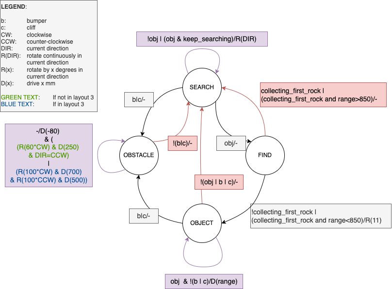

## Microcontroller Programming Assignment 3 Algorithm Testing

---

**Branch: Master**

### Algorithm:
1. Search until see the closest rock (less than 850mm)
2. Approximately center the closest rock
3. Drive towards the closest rock
4. Bump the rock
5. Search for the second rock
6. Approximately center the second rock
7. Drive to the second rock
8. **If on the 3rd layout**
   1. If sense a cliff on the way to the second rock, drive down to clear the gap
   2. Drive right to go into the right-half of the layout
   3. Search for the second rock
   4. Drive to the second rock
9. Stop approximately 85 mm before rock (210/2- *Rock Radius*:40/2)

### FSM


###
Run ```manim -ql -p MCP_A3.py MarsRoverNavigation``` to run the code